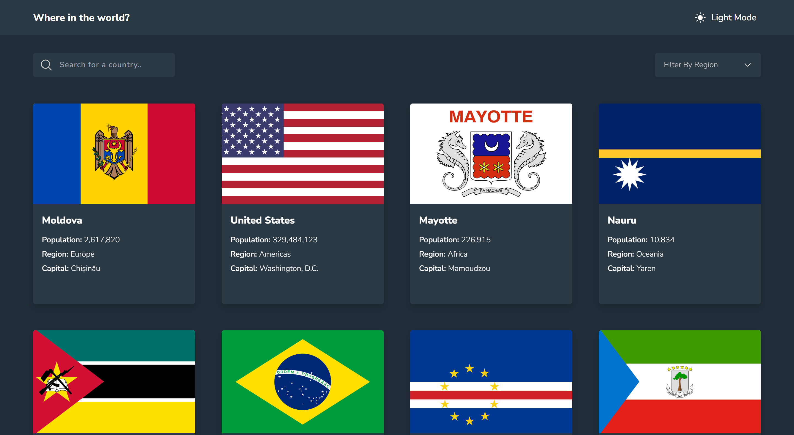
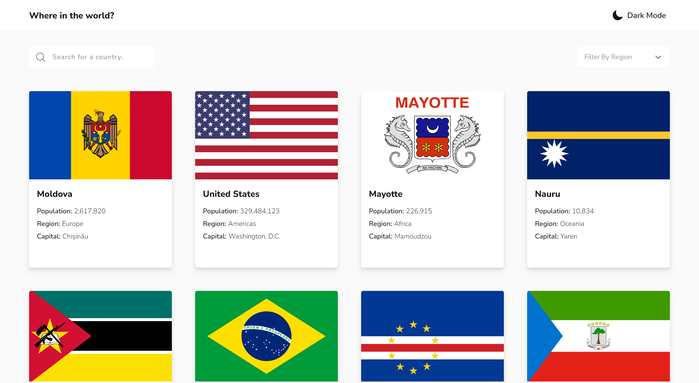

# Frontend Mentor - REST Countries API with color theme switcher solution

This is a solution to the [REST Countries API with color theme switcher challenge on Frontend Mentor](https://www.frontendmentor.io/challenges/rest-countries-api-with-color-theme-switcher-5cacc469fec04111f7b848ca). Frontend Mentor challenges help you improve your coding skills by building realistic projects.

## Table of contents

- [Overview](#overview)
  - [The challenge](#the-challenge)
  - [Screenshot](#screenshot)
  - [Links](#links)
- [My process](#my-process)
  - [Built with](#built-with)
  - [What I learned](#what-i-learned)
  - [Continued development](#continued-development)
  - [Useful resources](#useful-resources)
- [Author](#author)
- [Acknowledgments](#acknowledgments)

## Overview

### The challenge

Users should be able to:

- See all countries from the API on the homepage ✅
- Search for a country using an `input` field ✅
- Filter countries by region ✅
- Click on a country to see more detailed information on a separate page ✅
- Click through to the border countries on the detail page ✅
- Toggle the color scheme between light and dark mode _(optional)_ ✅

### Screenshot

- Dark Mode
  

- Light Mode
  

### Links

- Solution URL: [Add solution URL here](https://your-solution-url.com)
- Live Site URL: [Add live site URL here](https://your-live-site-url.com)

## My process

### Built with

- [Typescript](https://reactjs.org/) - For strong typing
- [React](https://reactjs.org/) - JS library
  - [React Router](https://reactrouter.com/en/main) - Routing
  - [React Query (Tanstack)](https://tanstack.com/query/latest/docs/framework/react/overview) - JS library
  - [React Spring](https://www.react-spring.dev/) - Animation library
- [Tailwind CSS](https://tailwindcss.com/) - Utility-first CSS framework
- [Vite](https://vitejs.dev/guide/) - Build tool
- Semantic HTML5 markup
- Mobile-first workflow

### What I learned

I basically used this project to improve my Typescript skills. I learned a couple of techniques for efficiently typing variables.
One of my favourite things I used a lot in this project was the `Pick` _Mapped Type_, basically the opposite of `Omit` (as I've come to learn). Pretty handy for reusing types from an existing type without having to manually type them.

An example of somewhere I used it was to type the `CountryCard` _props_;

```ts
type CountryCardProps = Pick<
  Country,
  "flags" | "name" | "population" | "region" | "capital" | "continents" | "cca2"
> & { index: number };

function CountryCard(props: CountryCardProps) {
  // ...
}
```

Just beautiful! 😋

I also made the decision to try out _React Spring_ for animation, instead of the usual _Framer Motion_ I'm used to. It was a rather basic use, but I got a practical feel for how it works

I also tried my best to store `search` and `filter` state in the _URL_ so it works seamlessly even when you paste in something like;

```
https://reactjs.org/?search=Nigeria&filter=Africa
```

### Continued development

Use this section to outline areas that you want to continue focusing on in future projects. These could be concepts you're still not completely comfortable with or techniques you found useful that you want to refine and perfect.

**Note: Delete this note and the content within this section and replace with your own plans for continued development.**

### Useful resources

- [Example resource 1](https://www.example.com) - This helped me for XYZ reason. I really liked this pattern and will use it going forward.
- [Example resource 2](https://www.example.com) - This is an amazing article which helped me finally understand XYZ. I'd recommend it to anyone still learning this concept.

**Note: Delete this note and replace the list above with resources that helped you during the challenge. These could come in handy for anyone viewing your solution or for yourself when you look back on this project in the future.**

## Author

- Website - [Add your name here](https://www.your-site.com)
- Frontend Mentor - [@yourusername](https://www.frontendmentor.io/profile/yourusername)
- Twitter - [@yourusername](https://www.twitter.com/yourusername)

**Note: Delete this note and add/remove/edit lines above based on what links you'd like to share.**

## Acknowledgments

This is where you can give a hat tip to anyone who helped you out on this project. Perhaps you worked in a team or got some inspiration from someone else's solution. This is the perfect place to give them some credit.

**Note: Delete this note and edit this section's content as necessary. If you completed this challenge by yourself, feel free to delete this section entirely.**
