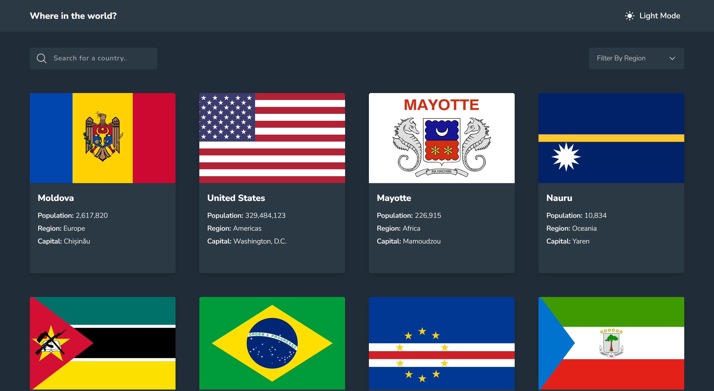
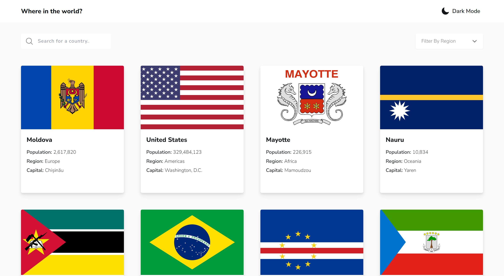

# Frontend Mentor - REST Countries API with color theme switcher solution

This is a solution to the [REST Countries API with color theme switcher challenge on Frontend Mentor](https://www.frontendmentor.io/challenges/rest-countries-api-with-color-theme-switcher-5cacc469fec04111f7b848ca). Frontend Mentor challenges help you improve your coding skills by building realistic projects.

## Table of contents

- [Overview](#overview)
  - [The challenge](#the-challenge)
  - [Screenshot](#screenshot)
  - [Links](#links)
- [My process](#my-process)
  - [Built with](#built-with)
  - [What I learned](#what-i-learned)
  - [Continued development](#continued-development)
  - [Useful resources](#useful-resources)
- [Author](#author)
- [Acknowledgments](#acknowledgments)

## Overview

### The challenge

Users should be able to:

- See all countries from the API on the homepage ✅
- Search for a country using an `input` field ✅
- Filter countries by region ✅
- Click on a country to see more detailed information on a separate page ✅
- Click through to the border countries on the detail page ✅
- Toggle the color scheme between light and dark mode _(optional)_ ✅

### Screenshot

- Dark Mode
  

- Light Mode
  

### Links

- Solution URL: [Frontend Mentor Solution](https://www.frontendmentor.io/solutions/responsive-rest-countries-api-webapp-r88gX-8liw)
- Live Site URL: [fm-rest-countries.vercel.app](https://fm-rest-countries-one.vercel.app)

## My process

### Built with

- [Typescript](https://reactjs.org/) - For strong typing
- [React](https://reactjs.org/) - JS library
  - [React Router](https://reactrouter.com/en/main) - Routing
  - [React Query (Tanstack)](https://tanstack.com/query/latest/docs/framework/react/overview) - JS library
  - [React Spring](https://www.react-spring.dev/) - Animation library
- [Tailwind CSS](https://tailwindcss.com/) - Utility-first CSS framework
- [Vite](https://vitejs.dev/guide/) - Build tool
- Semantic HTML5 markup
- Mobile-first workflow

### What I learned

I basically used this project to improve my Typescript skills. I learned a couple of techniques for efficiently typing variables.
One of my favourite things I used a lot in this project was the `Pick` _Mapped Type_, basically the opposite of `Omit` (as I've come to learn). Pretty handy for reusing types from an existing type without having to manually type them.

An example of somewhere I used it was to type the `CountryCard` _props_;

```ts
type CountryCardProps = Pick<
  Country,
  "flags" | "name" | "population" | "region" | "capital" | "continents" | "cca2"
> & { index: number };

function CountryCard(props: CountryCardProps) {
  // ...
}
```

Just beautiful! 😋

I also made the decision to try out _React Spring_ for animation, instead of the usual _Framer Motion_ I'm used to. It was a rather basic use, but I got a practical feel for how it works

I also tried my best to store `search` and `filter` state in the _URL_ so it works seamlessly even when you paste in something like;

```
https://fm-rest-countries-one.vercel.app/?search=Nigeria&filter=Africa
```

The [link](https://fm-rest-countries-one.vercel.app/?search=Nigeria&filter=Africa) works as it should! 🥳

### Continued development

I'll just keep building my Typescript skills. It's fun!

### Useful resources

- [HTML \<dl\> Tag](https://www.w3schools.com/tags/tag_dl.asp) - I learned to use semantic description list tags

## Author

<!-- - Website - [Add your name here](https://www.your-site.com) -->

- Frontend Mentor - [@memoye](https://www.frontendmentor.io/profile/memoye)
- Twitter - [@memoye_io](https://www.twitter.com/memoye_io)
- LinkedIn - [Brown Memoye](https://www.linkedin.com/in/b-me)

## Acknowledgments

Thanks me! 😊
